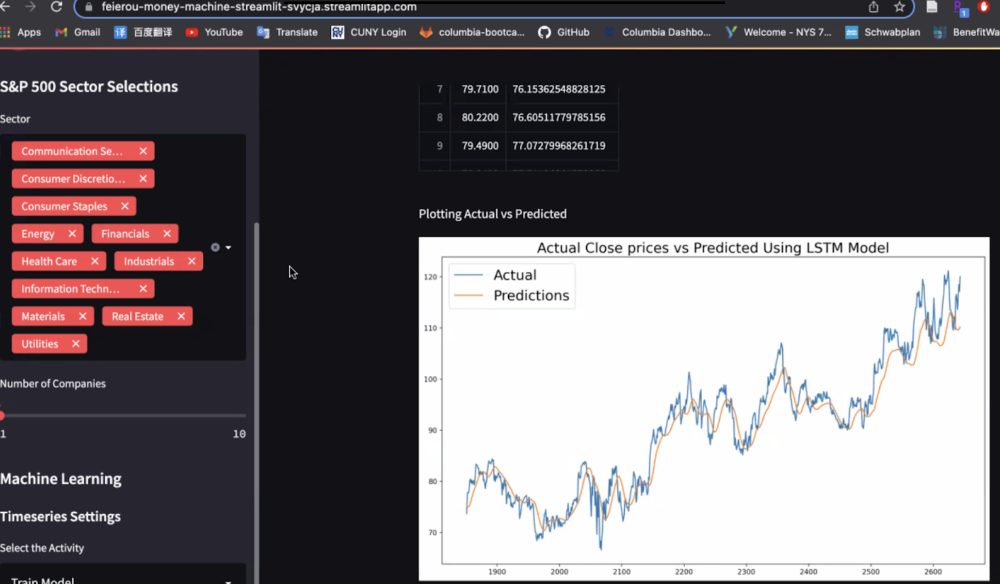

# Money Machine

This repo contains the results of the Money Machine group project. 
 

Equity market has been always portrayed as a glamorous money-making career. However, complex and precise decisions are integral part of making choices and split decisions that result in great rewards.

There are numerous ways means to make buy and sell decisions or evaluations. From making fundamentals analysis into the financials of a company, coverages on Bloomberg, to tweets made by important internet personalities. All these information can and are some mean to get an correct estimate of the how the market is going to trend.
With Money Machine, we aim to use the historical data on the prices and trends, and use machine learning methods to get insight into the intrecate datas, which further will assist the user to make investment decisions.

The application is interactive and allows user to explore different sectors of S&P 500 and see their financial performance over the years. Moreover, the application also ranks the stocks in the sector based on their current risk to return parity. All these features enlightens the user over the best investment prospects.
The application is designed to use SVM(Service Vector Machine) and LSTM (Long Short-Term Machine) to take a deep dive into the publically available price trends to make predictions into the future.

---

## Installation Guide

First, install the following libraries and functions into our development environment:
(1) hvplot, (2) Matplotlib, (3)Keras, (4) yfinance, (5) Plotly, (6) seaborn, (7) panda_datareaders , (8) Tensorflow

Before running the program make sure to install the following dependencies:

    python
    pip install pathlib
    conda install -c conda-forge scikit-learn
    conda install -c pyviz hvplot
    !pip install yfinance
    !pip install python-dotenv
    !pip install pandas_datareader
    !pip install keras
    !pip install tensorflow

---

## Technologies

This project leverages python 3.7 with the following libraries and dependencies:

* [pandas](https://github.com/pandas-dev/pandas) - For manipulating data

* [hvplot](https://github.com/holoviz/hvplot) - High-level plotting API for the PyData ecosystem built on HoloViews

* [sci-kit learn](https://github.com/scikit-learn/scikit-learn) - Python machine learning library. Used for support vector machine (SVM) model

* [tensor flow](https://github.com/tensorflow/tensorflow) - Open-source software library for machine learning and deep neural networks

* [keras](https://github.com/keras-team/keras) - Open-source software library that provides a Python interface for artificial neural network. Used for long short-term memory (LSTM) model

* [google colab](https://github.com/googlecolab/colabtools) - Notebooks that allow us to combine executable code and rich text in a single document

---

### **Money Machine Analysis**

### **Flow Chart**

### **Sector Analysis and Stock Selection**

1. The first function of the program is to call market data from y finance
2. Next the user will select a market sector to focus their analysis on
3. The program will return a list of all securities in the chosen sector
4. Next the program will calculate the Sharpe and Sortino ratios of the stocks in that sector in order to assist the user in selecting the asset with the best risk/return ratio
5. Finally, once the stock has been selected, the user will set a desired timeframe and the program will pull in the necessary data for the subsequent analysis

### **Using SVM model for Predictions**

(2) Calculated the correlation among real estate prices in NY, LA, and national mortgage rates.

### **Using LSTM model for Predictions**

For this part of the assignment, we attempted to forecast the median prices for real estate prices in NY and LA. 

(1) Ran a monte carlo simulation for real estate prices in LA.

### **Conclusions**

Based on our analysis, we came to the following conclusions:

(A) LA real estate prices are increasing at a higher rate than NY (Queens County) real estate prices.

(B) Real estate prices are inversely correlated with mortgage rates.

(C) Invest in real estate because returns are extremely positive.
       
       There is a 95% chance that the LA median home value over the next thirty years will be within the range of $4,990,809.80 and $8,224,836.22.

       There is a 95% chance that the NY median home value over the next thirty years will be within the range of $1,901,451.6 and $2,323,568.72.

       If we invest $500K in LA real estate now, we predict a 1215.7% return on investment in 30 years.

       If we invest $500k in NY (Queens County) real estate now, we predict a 318.6% return on investment in 30 years.

---
## Contributors

Brought to you by Winnie Mei, Babin Shrestha, Matthew Field, Feier Ou, and Wilson Rosa 

---
## License

MIT
